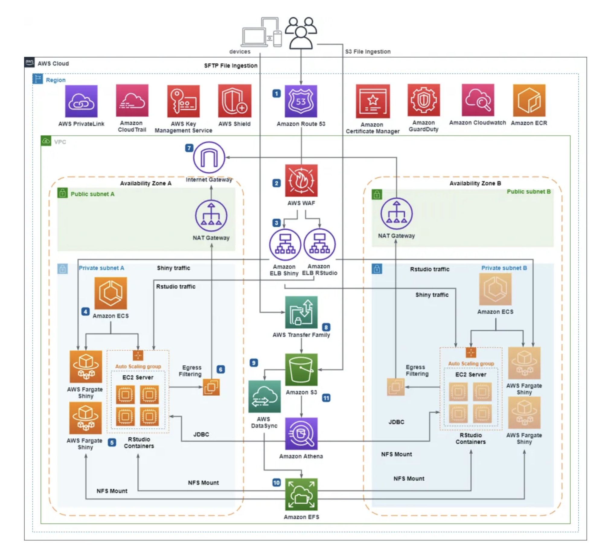

### 2. AWS Cloud Best Practices

Below are detailed steps to implement each best practice:

#### 1. Use a Multi-Account Strategy for Environment Separation (dev/stage/prod)
- Create separate AWS accounts for development, staging, and production environments.
- Use AWS Organizations to centrally manage accounts and apply Service Control Policies (SCPs).
- Set up consolidated billing for cost management.
- Restrict cross-account access using IAM roles and resource policies.

#### 2. Apply Least Privilege IAM Roles and Policies
- Define IAM roles for each application and service with only the permissions required.
- Regularly audit IAM users, groups, and roles for unused permissions.
- Use IAM policy versioning and conditions to further restrict access.
- Enable MFA for all users, especially those with elevated privileges.

#### 3. Enable CloudTrail and Config for Auditing and Compliance
- Turn on AWS CloudTrail in all regions to capture API activity.
- Store CloudTrail logs in a secure, centralized S3 bucket.
- Enable AWS Config to record and evaluate resource configurations.
- Set up Config rules to enforce compliance and trigger alerts on violations.

#### 4. Enforce Resource Tagging for Visibility and Cost Allocation
- Define a tagging policy (e.g., environment, owner, project, cost center).
- Use AWS Tag Editor and Resource Groups to manage and audit tags.
- Enforce tagging compliance with AWS Config rules or Lambda functions.
- Leverage tags in AWS Cost Explorer for detailed cost allocation.

#### 5. Use Autoscaling Groups and ELBs for High Availability
- Deploy applications in Auto Scaling Groups (ASGs) to automatically adjust capacity.
- Use Elastic Load Balancers (ELB/ALB/NLB) to distribute traffic across healthy instances.
- Configure health checks and scaling policies based on metrics.
- Deploy across multiple Availability Zones for fault tolerance.

#### 6. Design VPCs with Private/Public Subnets, NAT Gateways, and Security Groups
- Create a VPC with both public and private subnets in multiple AZs.
- Place internet-facing resources (e.g., ALBs) in public subnets.
- Deploy application and database servers in private subnets.
- Use NAT Gateways for outbound internet access from private subnets.
- Define security groups and NACLs to control inbound/outbound traffic.

#### 7. Automate Backups with AWS Backup
- Use AWS Backup to define backup plans for EC2, RDS, EFS, DynamoDB, etc.
- Schedule regular backups and define retention policies.
- Enable cross-region and cross-account backup copies for disaster recovery.
- Monitor backup jobs and set up alerts for failures.

#### 8. Use S3 with Lifecycle Policies and Versioning
- Enable versioning on S3 buckets to protect against accidental deletions.
- Define lifecycle policies to transition objects to cheaper storage classes or delete them after a set period.
- Enable server-side encryption for data at rest.
- Use S3 Access Logs and Bucket Policies for monitoring and access control.

#### 9. Manage Infrastructure as Code with Terraform or CloudFormation
- Define infrastructure resources in code using Terraform or AWS CloudFormation templates.
- Store templates in version control (e.g., Git).
- Use CI/CD pipelines to automate deployments and updates.
- Validate changes in non-production environments before applying to production.

#### 10. Monitor with CloudWatch, X-Ray, and GuardDuty
- Set up CloudWatch metrics, logs, and alarms for all critical resources.
- Use AWS X-Ray for distributed tracing and performance analysis.
- Enable GuardDuty for continuous threat detection and security monitoring.
- Integrate monitoring with notification services (e.g., SNS, Slack) for real-time alerts.

---

