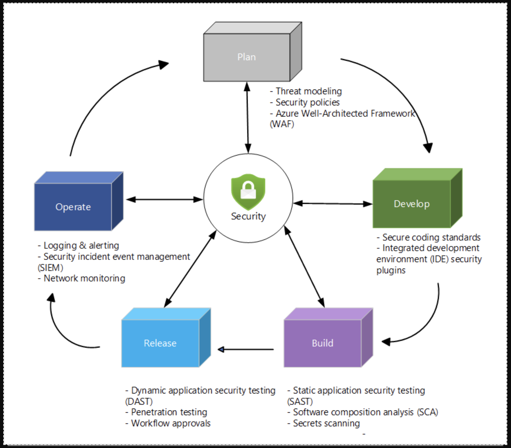

### 3. Security Best Practices

#### 1. Secure APIs and Endpoints with OAuth2 and RBAC
- Implement OAuth2 for authentication, issuing access tokens to clients.
- Define roles and permissions using Role-Based Access Control (RBAC).
- Restrict API endpoints based on user roles.
- Regularly review and update access policies.

#### 2. Centralize Logging and Alerting for Intrusion Detection
- Deploy a centralized logging solution (e.g., ELK Stack, CloudWatch).
- Forward logs from all services and infrastructure components.
- Set up real-time alerts for suspicious activities (e.g., failed logins, privilege escalations).
- Regularly review logs and tune alerting rules.

#### 3. Rotate IAM Credentials; Use Short-Lived Tokens
- Enforce regular rotation of IAM user credentials and access keys.
- Prefer temporary credentials (e.g., AWS STS, Azure Managed Identities).
- Automate credential rotation and removal of unused credentials.

#### 4. Encrypt Data at Rest and in Transit
- Enable encryption for storage services (e.g., EBS, S3) using managed keys (KMS).
- Enforce TLS 1.2 or higher for all data in transit.
- Regularly audit encryption configurations and key management policies.

#### 5. Scan Container Images and Code Repositories for Vulnerabilities
- Integrate vulnerability scanning tools (e.g., Snyk, Trivy, Clair) into CI/CD pipelines.
- Scan all container images before deployment.
- Use static code analysis tools to detect insecure code patterns.
- Address and remediate identified vulnerabilities promptly.

#### 6. Use WAF and Shield for DDoS Protection
- Deploy a Web Application Firewall (WAF) to filter malicious traffic.
- Enable DDoS protection services (e.g., AWS Shield, Azure DDoS Protection).
- Regularly update WAF rules and monitor attack reports.

#### 7. Conduct Regular Security Audits and Compliance Checks
- Schedule periodic security assessments and penetration tests.
- Use automated compliance tools (e.g., AWS Config, Azure Policy).
- Document findings and track remediation efforts.

#### 8. Apply OS Hardening and Patching
- Disable unnecessary services and ports on all servers.
- Apply security patches promptly using automated patch management.
- Use hardened OS images as a baseline for deployments.

#### 9. Enforce MFA and Conditional Access
- Require Multi-Factor Authentication (MFA) for all privileged accounts.
- Implement conditional access policies (e.g., IP restrictions, device compliance).
- Regularly review MFA enrollment and access logs.

#### 10. Audit IAM Changes and Enforce Least Privilege
- Enable logging for all IAM changes (e.g., CloudTrail, Azure AD logs).
- Review IAM policies and permissions regularly.
- Remove unused accounts and restrict permissions to the minimum required.

