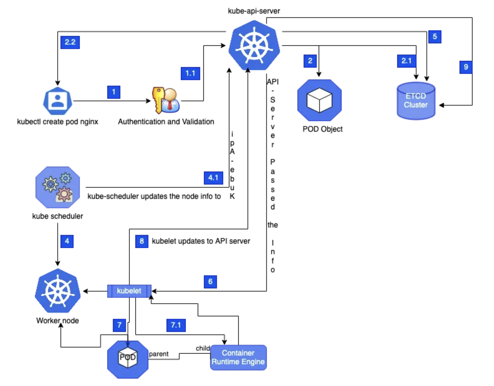

### 5. Kubernetes Architecture

A robust Kubernetes architecture is essential for scalable, secure, and maintainable deployments. The following best practices and components are recommended:

#### Managed Kubernetes (EKS)
- **Amazon EKS** is used to offload cluster management tasks such as control plane provisioning, upgrades, and patching.
- EKS provides built-in security integrations with AWS IAM, making cluster authentication and authorization easier.
- Managed upgrades reduce operational overhead and ensure timely security patches.

#### Deployment Strategies
- **Helm Charts**: Package, version, and deploy applications consistently across environments. Helm enables easy rollbacks and templating.
- **Kustomize**: Overlay environment-specific configurations (dev, staging, prod) without duplicating manifests, supporting GitOps workflows.

#### Multi-Tenancy and Access Control
- **Namespaces**: Segment workloads for isolation, resource quotas, and easier management.
- **RBAC (Role-Based Access Control)**: Define granular permissions for users, groups, and service accounts, ensuring least-privilege access.

#### Network and Pod Security
- **Network Policies**: Restrict traffic between pods and namespaces, enforcing zero-trust networking.
- **PodSecurityPolicies** (or Pod Security Admission): Control security-sensitive aspects of pod specification, such as privilege escalation and host networking.

#### Scalability
- **Cluster Autoscaler**: Automatically adjusts the number of nodes based on resource demands.
- **Horizontal Pod Autoscaler**: Scales pods in/out based on CPU/memory or custom metrics.

#### Observability and Sidecars
- **Sidecar Containers**: Attach logging (e.g., Fluentd), monitoring (e.g., Prometheus exporters), and security agents (e.g., Istio Envoy) to application pods for enhanced observability and control.
- **Prometheus & Grafana**: Collect and visualize metrics for proactive monitoring.
- **Fluentd**: Aggregate and forward logs to centralized storage or analysis platforms.

#### Security and Disaster Recovery
- **etcd Security**: Encrypt etcd at rest, restrict access to only the API server, and use TLS for communication.
- **API Server Security**: Enable audit logging, restrict public access, and use network policies/firewalls.
- **Backups**: Regularly back up etcd data and use **Velero** for cluster resource and persistent volume backups, supporting disaster recovery scenarios.

#### Application Health
- **Liveness Probes**: Detect and restart unhealthy containers automatically.
- **Readiness Probes**: Ensure traffic is only routed to pods that are ready to serve requests.

By following these architectural principles, the Kubernetes platform will be secure, resilient, and adaptable to evolving business and technical requirements.

---
