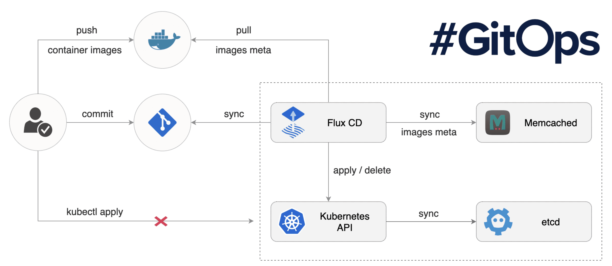

### 9. GitOps Architecture

GitOps is a modern approach to managing infrastructure and application deployments using Git as the single source of truth. Below are the key steps to implement a robust GitOps architecture:

#### 1. Store All Infrastructure and App Configs in Git
- Version control all Kubernetes manifests, Helm charts, and infrastructure-as-code (IaC) files in a Git repository.
- Organize repositories by environment, application, or team as needed.

#### 2. Use ArgoCD or FluxCD to Sync Git State with Clusters
- Deploy a GitOps operator (e.g., ArgoCD or FluxCD) in each target cluster.
- Configure the operator to watch the Git repository and automatically apply changes to the cluster.

#### 3. Use PR-Based Workflows with Approvals
- Require all changes to go through pull requests (PRs).
- Set up mandatory code reviews and approval checks before merging.

#### 4. Track Changes and Rollbacks via Git History
- Leverage Git commit history to audit changes.
- Use Git revert or rollback features to restore previous states if needed.

#### 5. Automate Promotion Between Environments
- Use automated pipelines to promote changes from development to staging and production.
- Trigger promotions via Git tags, branches, or PR merges.

#### 6. Maintain Separate Branches for Dev/Stage/Prod
- Create dedicated branches for each environment (e.g., `dev`, `stage`, `prod`).
- Merge changes progressively to promote them through the environments.

#### 7. Use Templates and Overlays for Customization
- Employ tools like Kustomize or Helm to manage environment-specific configurations.
- Use overlays or values files to customize deployments per environment.

#### 8. Monitor Git Sync Status and Reconcile Drift
- Enable status monitoring in ArgoCD/FluxCD dashboards.
- Set up alerts for drift detection when the cluster state diverges from Git.

#### 9. Integrate with Policy Engines (OPA, Kyverno)
- Enforce security and compliance policies using tools like Open Policy Agent (OPA) or Kyverno.
- Validate configurations before they are applied to the cluster.

#### 10. Educate Teams on GitOps Workflows and Security
- Provide training and documentation on GitOps best practices.
- Emphasize secure Git usage, access controls, and secret management.

---
